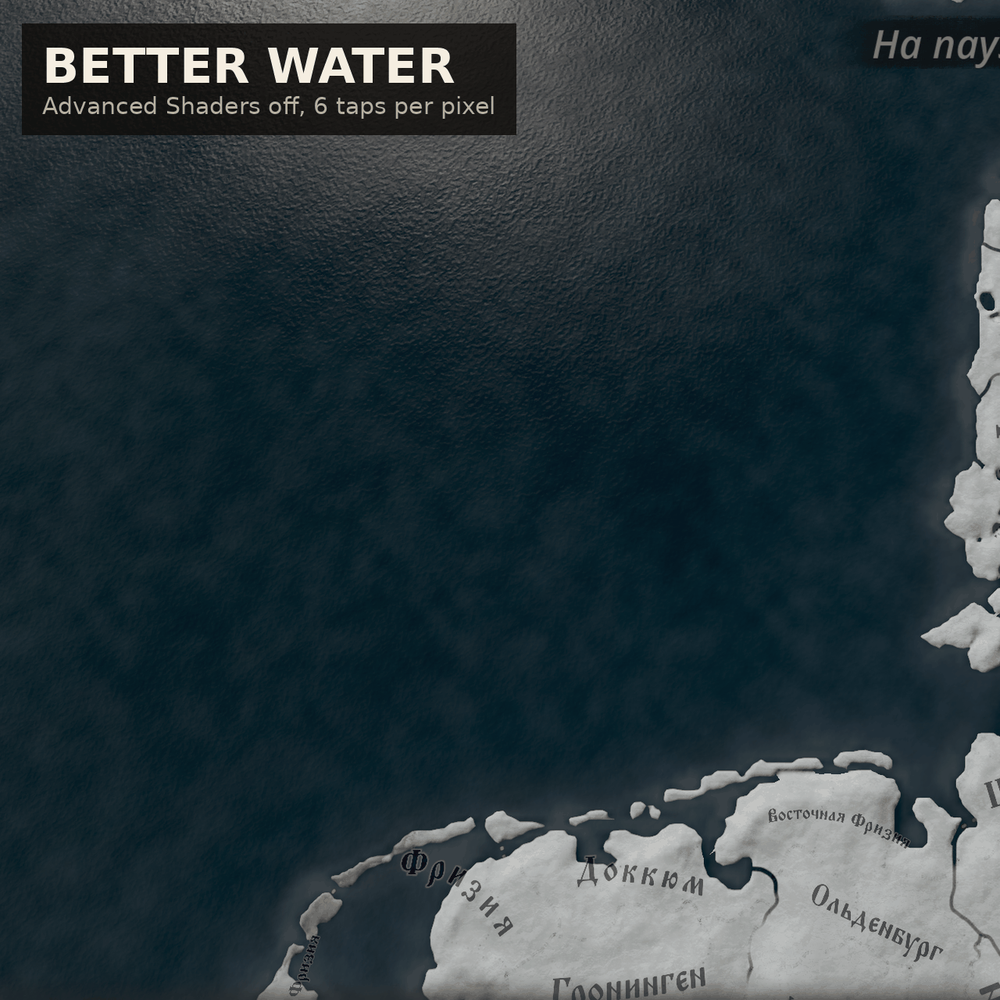

# Better Water Without Advanced Shaders (CK3)

Освещённая вода на карте при выключенной настройке **«Дополнительные эффекты
шейдеров»**. Ванильный low-spec рисует океан как карту цвета с затуханием у берега и
больше ничего; этот мод даёт ему два слоя бегущих волн, солнечный блик, отражение неба
по Френелю и смену цвета глубокая/мелкая вода: вид полного шейдера воды из одних его
дешёвых частей, 6 выборок текстур на пиксель там, где ванильный low-spec уже тратил 11.

Не зависит от других модов; сочетается с
[Sharp Terrain Without Advanced Shaders](https://github.com/mekedron/ck3-lowspec-terrain-fix)
и его дополнением [Real Snow](https://github.com/mekedron/ck3-lowspec-real-snow).

## Причина

С выключенной настройкой океан рисуется эффектом `waterLowSpec` из
`game/gfx/FX/pdxwater.shader`. Его пиксельный шейдер `CalcWaterLowSpec` читает карту
цвета воды и считает затухание у берега, причём одно затухание вызывает
`GetHeightMultisample`, размытие heightmap в 9 тапов (10 выборок с indirection). И всё:
ни нормалей, ни света, ни отражений. С озёрами наоборот: у них low-spec эффекта нет
вовсе (`lake`, `lake_mapobject` всегда используют полный `PixelShader`), так что
low-spec карта рисует каждое озеро high-spec водой на ~50 выборок.

## Исправление

`gfx/FX/jomini/jomini_water_default.fxh` получает одну функцию `CalcWaterCheap`,
собранную из дешёвых частей ванильного `CalcWater`:

| оставлено | убрано |
| --- | --- |
| слои волновых нормалей 1 и 2 (2 выборки) | слой 3, flow-карты (8 выборок) |
| диффуз солнца + блик Блинна-Фонга, константы солнечного сценария | теневая карта, маска облаков, двойной сценарий |
| cubemap неба через Френель (1 выборка) | рефракция (3 выборки и отдельный проход) |
| цвет глубокой/мелкой воды по углу, тонировка карты цвета | пена (6 выборок), набегающие волны (10 выборок) |
| затухание у берега по одной выборке высоты (2 fetch) | 9-таповое размытие высоты |

`gfx/FX/pdxwater.shader` вызывает её из `PixelShaderLowSpec` (океан) и, при
определённом `LOW_SPEC_SHADERS`, из `PixelShader` (озёра). С включённой настройкой
ничего не меняется. Оба переключателя в `gfx/FX/better_water_options.fxh`
(`WATEROPT_CHEAP_WAVES`, `WATEROPT_CHEAP_LAKES`); закомментируйте, запустите
`./install.sh`, перезапустите игру — вернётся ваниль для этой части. Реки не тронуты:
ваниль и в low-spec рисует их полным шейдером, а места на экране они занимают мало.

## Цена

Замерено на RTX 3050 Ti Laptop (4 ГБ) при 5120x1440 на Северном море: low-spec 60 FPS
с vsync удержались. На пиксель воды мод делает 6 выборок (высота 2, цвет 1, волны 2,
cubemap 1) против 11 у ванильного low-spec, плюс математика освещения; озёра с ~50
выборок падают до 6.

## Структура

    descriptor.mod                              метаданные мода
    thumbnail.png                               превью для Workshop, в корне мода
    gfx/FX/pdxwater.shader                      переопределяет game/gfx/FX/pdxwater.shader
    gfx/FX/jomini/jomini_water_default.fxh      переопределяет game/gfx/FX/jomini/jomini_water_default.fxh
    gfx/FX/better_water_options.fxh             два переключателя (новый файл)
    install.sh                                  копирует мод в Proton-префикс
    tools/compile_check.py                      офлайн-проверка компиляции через DXC
    tools/check_log.sh                          проверка монтирования и ошибок шейдеров после запуска
    tools/diff_vanilla.sh                       повторный дифф со Steam-файлами после патча
    steam-workshop/                             тексты для листинга и генератор превью

## Установка

Запустите `./install.sh`. Он копирует мод в папку модов CK3 внутри Proton-префикса,
затем включите «Better Water Without Advanced Shaders» в плейсете лаунчера. Держите
**«Дополнительные эффекты шейдеров» выключенными**: с ними игра использует high-spec
воду, и мод ничего не меняет. Первая загрузка карты медленнее, пока компилируются
шейдеры.

## Проверка без запуска игры

    tools/compile_check.py --dxc <каталог с bin/dxc и lib/libdxcompiler.so>

берёт из кэша шейдеров игры ванильные записи `water`, `waterLowSpec` и `lake`
(развёрнутый HLSL), подставляет блоки кода мода и компилирует их через DXC.

## Версия игры

Собран под 1.19.0.6 (Scribe). Оба переопределения заменяют ванильный файл целиком,
поэтому после патча запустите `tools/diff_vanilla.sh` и перенесите баннеры на новые
ванильные копии. `jomini_water_default.fxh` подключается и шейдером рек, поэтому новая
функция добавлена в конец, а существующее не правилось.

## Совместимость

Полностью заменяет `gfx/FX/pdxwater.shader` и `gfx/FX/jomini/jomini_water_default.fxh`;
конфликтует только с модами, правящими эти файлы, в основном с переработками воды и
графики карты. Fast Advanced Shaders уже содержит эту воду, вместе их не ставят.

## Мультиплеер / достижения

Файлы шейдеров не входят в контрольную сумму, но лаунчер всё равно помечает любой мод
как мод. Относитесь к нему как к любому графическому моду.
